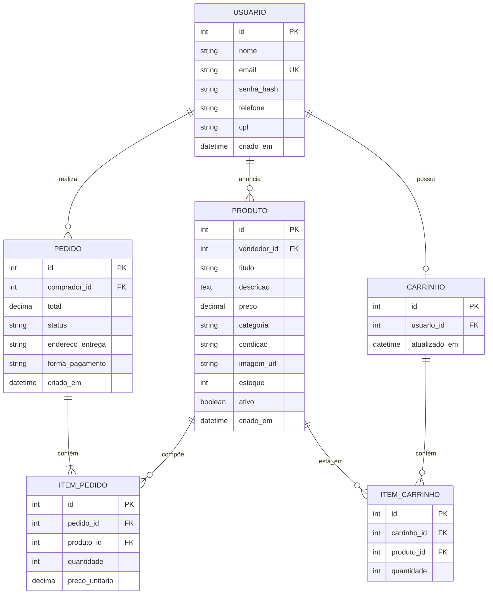
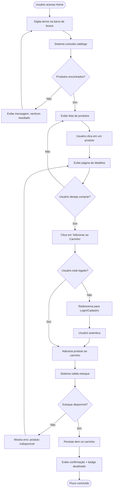

# DIAGRAMAS - TechBazar

Este documento contém os diagramas conceituais do sistema TechBazar em sintaxe **Mermaid**.

> Para visualizar: cole o código em [https://mermaid.live](https://mermaid.live) ou abra este `.md` no GitHub/GitLab (renderização automática).

---

## 1. Diagrama Entidade-Relacionamento (ER)

Representa as principais entidades do domínio e seus relacionamentos.

### Notas sobre o modelo

- **USUARIO** pode ser tanto comprador quanto vendedor (papel definido pelo contexto da operação).
- **PRODUTO** pertence sempre a um vendedor (`vendedor_id`).
- **CARRINHO** é único por usuário (relação 1-1 opcional).
- **PEDIDO** congela o `preco_unitario` no momento da compra (snapshot histórico).
- Status do pedido: `pendente | pago | enviado | entregue | cancelado`.

---

## 2. Diagrama de Fluxo: Buscar Produto e Adicionar ao Carrinho

Representa a jornada do usuário desde a busca até a confirmação do item no carrinho.

### Pontos-chave do fluxo

1. **Busca pública**: não exige login para pesquisar ou visualizar produtos.
2. **Login obrigatório no carrinho**: o usuário só pode adicionar itens após autenticar.
3. **Validação de estoque**: feita server-side antes de persistir.
4. **Feedback visual**: badge do carrinho é atualizado em tempo real (HTMX ou JS).

---

## 3. Próximos diagramas (futuros)

- Fluxo de checkout e pagamento
- Diagrama de sequência da API REST
- Diagrama de componentes (camadas Django)
